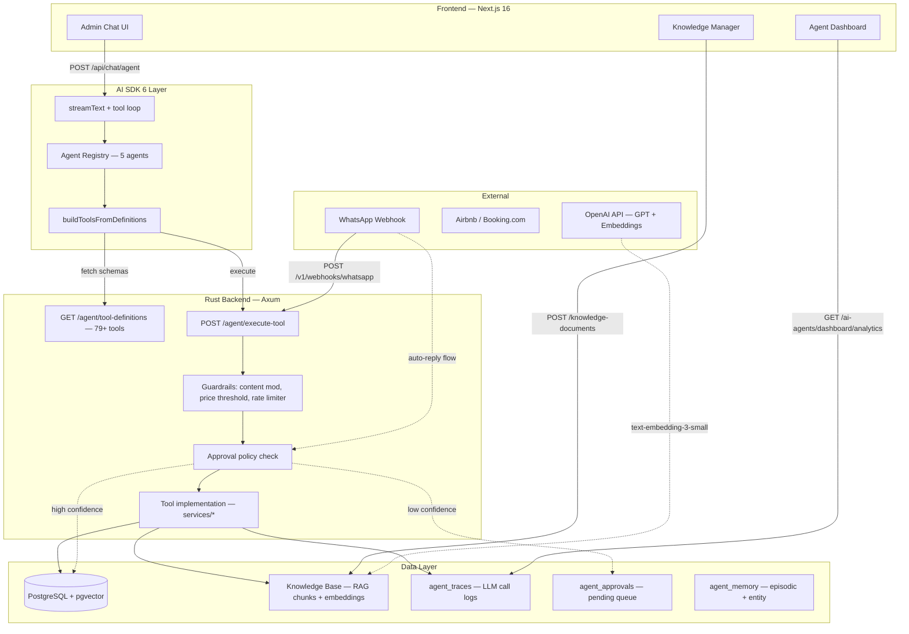
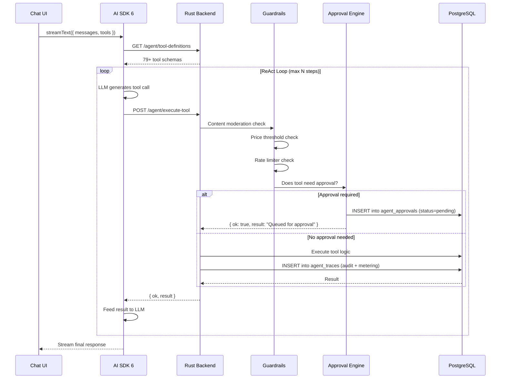

# Casaora Agent Platform — Architecture Guide

This repository runs a dual-app stack:
- **`apps/admin`**: Next.js 16 admin + public marketplace
- **`apps/backend-rs`**: Rust/Axum backend with PostgreSQL table-service routers

## Architecture Overview



## Agent Registry

| Slug | Name | Description | Max Steps | Tool Count | Key Routing Rules |
|------|------|-------------|-----------|------------|-------------------|
| `supervisor` | Operations Supervisor | Orchestrates multi-agent workflows. Routes requests to specialist agents and handles cross-domain escalations. | 12 | 18 | Classify → delegate to specialist. Handle cross-domain (2+ domains) sequentially. Block spend exceeding org limits. |
| `guest-concierge` | Guest Concierge | Primary operations copilot. Guest inquiries, reservations, daily ops briefing, property management. | 10 | All (79+) | Search knowledge base first for property-specific info. Auto-store memories after resolving issues. Finance gate: human review for >$5K. |
| `leasing-agent` | Leasing Agent | Full leasing funnel: lead qualification, property matching, viewings, screening, lease execution. | 10 | 24 | Auto-advance applications scoring ≥70. Flag <40 for human review. Income-to-rent ≥3:1 for auto-qualification. 48h stalled follow-up. |
| `maintenance-triage` | Maintenance Triage | Autonomous maintenance dispatch. Classify requests, assign staff/vendors, monitor SLA, handle escalation. | 10 | 24 | SLA: Critical 4h, High 24h, Medium 72h, Low 1w. Vendor scoring: Specialty 40% + Rating 30% + Availability 20% + Proximity 10%. Auto-escalate on SLA breach. |
| `finance-agent` | Finance Agent | Financial operations: revenue analytics, collections, reconciliation, owner statements, expense categorization. | 8 | 38 | All calculations include 10% IVA (Paraguay). Flag >5% variance in collections. Owner statements reconcile to the penny. |

## How to Add a New Agent

### Step 1: Create agent config

Create `apps/admin/lib/agents/{slug}.ts`:

```typescript
import type { AgentConfig } from "./types";

export const myNewAgent: AgentConfig = {
  slug: "my-new-agent",
  name: "My New Agent",
  description: "What this agent does.",
  systemPrompt: `You are the My New Agent for Casaora...

  ## Decision Rules
  - Rule 1...
  - Rule 2...`,
  maxSteps: 10,
  mutationTools: ["create_row", "update_row"],
  allowedTools: ["list_rows", "get_row", "create_row", "update_row"],
};
```

### Step 2: Register in agent index

Update `apps/admin/lib/agents/index.ts`:

```typescript
import { myNewAgent } from "./my-new-agent";

export const agentRegistry: Record<string, AgentConfig> = {
  // ... existing agents
  "my-new-agent": myNewAgent,
};
```

### Step 3: Insert database record

```sql
INSERT INTO ai_agents (slug, name, description, icon_key, is_active, allowed_tools, system_prompt)
VALUES (
  'my-new-agent',
  'My New Agent',
  'What this agent does.',
  'settings',
  true,
  '["list_rows","get_row","create_row","update_row"]'::jsonb,
  'You are the My New Agent...'
);
```

### Step 4: Update supervisor routing

In `apps/admin/lib/agents/supervisor.ts`, add your agent to the `INTENT_RULES` section of the system prompt so the supervisor knows when to delegate to it.

### Step 5: Test

1. Open `/module/agent-dashboard` — verify agent appears in the list
2. Start a chat — verify routing works via supervisor
3. Check `/module/agent-dashboard` analytics — verify traces are logged

## Tool Execution Pipeline



### Guardrails

- **Content moderation**: Blocks harmful content in tool args
- **Price threshold**: Flags pricing changes >20% for human review
- **Rate limiter**: Per-org, per-agent rate limits on tool executions
- **Approval policies**: Configurable per-tool policies stored in `agent_approval_policies`

## Approval Pipeline

1. **Policy check**: When `execute_tool` is called, the system checks `agent_approval_policies` for the tool name
2. **Auto-approve**: If no policy exists or policy says `auto_approve: true`, execute immediately
3. **Queue**: If approval required, create `agent_approvals` record with status `pending`
4. **Admin review**: Admin sees pending approvals in the dashboard with reason, estimated impact, and tool args
5. **Execute**: On approval, `execute_approved_tool()` runs the original tool with stored args
6. **Reject**: On rejection, record is updated and the agent is notified

### Approval Record Fields

| Field | Description |
|-------|-------------|
| `agent_slug` | Which agent requested the action |
| `tool_name` | Tool to be executed |
| `tool_args` | JSON arguments for the tool |
| `kind` | Category (e.g., `guest_reply`, `mutation`, `financial`) |
| `priority` | `low` / `medium` / `high` / `critical` |
| `reason` | Human-readable explanation of why approval is needed |
| `estimated_impact` | JSON with channel, recipient, confidence, cost, etc. |
| `status` | `pending` → `approved`/`rejected`/`executed` |

## Example ReAct Flow

**Scenario**: Guest asks "What's the WiFi password?" via WhatsApp.

```
1. WhatsApp webhook → POST /v1/webhooks/whatsapp
   └─ Body: { from: "+595981123456", text: "What's the WiFi password?" }

2. generate_ai_reply() — guest-concierge agent activated
   └─ System prompt loaded with property context

3. LLM Step 1: Tool call → search_knowledge({ query: "WiFi password" })
   └─ Hybrid RAG: keyword search + vector similarity
   └─ RRF fusion ranks results
   └─ Returns: "WiFi network name on welcome card, password in welcome packet..."

4. LLM Step 2: Generate reply
   └─ "Hi! The WiFi network name is on the welcome card in the living room.
       The password is included in your welcome packet. If you can't find it,
       let me know and I'll check with the property manager!"

5. compute_confidence() → 0.85 (knowledge base hit + long response)
   └─ 0.85 ≥ 0.80 threshold → auto-send

6. queue_ai_reply() → INSERT into message_logs (status: queued, ai_generated: true)

7. process_queued_messages() → Send via WhatsApp API

8. Auto-eval: Score response quality, extract memories
   └─ store_memory({ type: "entity", key: "guest:+595981123456",
       value: "Asked about WiFi — directed to welcome packet" })
```

**Low-confidence scenario** (confidence < 0.80):
- Approval record created with `kind: guest_reply`, `priority: high`
- Admin sees draft reply text and confidence score in approval queue
- On approval → message sent; on rejection → admin can edit and send manually

## MCP Server

The `packages/mcp-server/` package exposes the Casaora tool API as an MCP server for use with Claude Desktop and other MCP clients.

**Setup**: Configure in `.mcp.json` with `CASAORA_API_BASE_URL`, `CASAORA_API_TOKEN`, and `CASAORA_ORG_ID`.

**Resources**:
- `casaora://org/{orgId}/snapshot` — Organization overview (properties, financials, occupancy)
- `casaora://org/{orgId}/knowledge/{query}` — Hybrid RAG knowledge search

## Operating Rules

1. Always validate with the latest docs when requirements are time-sensitive.
2. Prefer MCP-backed docs access first (Exa MCP, Casaora MCP).
3. Keep schema/API/frontend changes synchronized in the same PR whenever possible.

## Fast Project Map

- Product/roadmap: `docs/PRD.md`
- SQL schema + migrations: `db/schema.sql`, `db/migrations/*.sql`
- Backend routers: `apps/backend-rs/src/routes/*.rs`
- Backend services: `apps/backend-rs/src/services/*.rs`
- Frontend admin/public modules: `apps/admin/app/**/*`
- Agent configs: `apps/admin/lib/agents/*.ts`
- Shared UI primitives: `apps/admin/components/ui/*`
- MCP server: `packages/mcp-server/src/`

## Required Quality Gates

```bash
./scripts/quality-gate.sh        # full check
./scripts/quality-gate.sh fast   # skip admin build
```

## Deployment Guardrail

Before pushing to production (AWS ECS):

1. Apply pending SQL migrations to production DB.
2. Run `./scripts/quality-gate.sh`.
3. Verify `/marketplace`, `/module/applications`, `/module/leases`, `/module/owner-statements` manually.
