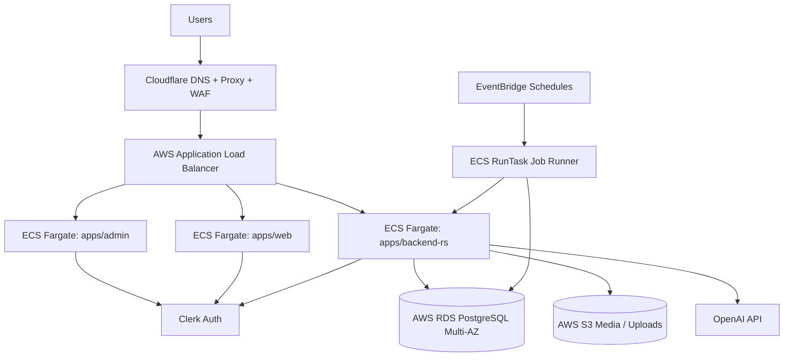

# Casaora

Enterprise-grade property operations platform for short-term rentals and hospitality workflows, running on AWS with Cloudflare edge security.

## Production Status

- `api.casaora.co` -> AWS ECS Fargate (Rust / Axum) behind ALB
- `app.casaora.co` -> AWS ECS Fargate (Next.js admin)
- `casaora.co` and `www.casaora.co` -> AWS ECS Fargate (Next.js web)
- PostgreSQL -> AWS RDS (Multi-AZ)
- Auth -> Clerk (custom domains enabled)
- Edge / DNS / TLS / proxy -> Cloudflare
- Infrastructure codification -> Terraform (remote state in S3 + DynamoDB locking)

## Architecture



## Repository Layout

- `apps/backend-rs` - Rust / Axum backend API (`/v1/*`)
- `apps/admin` - Next.js 16 admin application
- `apps/web` - Next.js public web / marketing application
- `db/schema.sql` - canonical schema snapshot
- `db/migrations/` - SQL migrations
- `infra/aws/` - ECS task definitions, AWS deployment docs
- `infra/terraform/aws/` - Terraform codification (remote state capable)
- `scripts/aws/` - AWS bootstrap / deploy / migration / ops scripts
- `docs/` - product + workflow documentation
- `packages/` - shared packages and MCP server

## Domains and Routing

### Public Domains

- `https://casaora.co` - web app (AWS ECS)
- `https://www.casaora.co` - web app (AWS ECS)
- `https://app.casaora.co` - admin app (AWS ECS)
- `https://api.casaora.co` - backend API (AWS ECS / ALB)

### Clerk Custom Domains

- `https://clerk.casaora.co` - Clerk frontend API domain
- `https://accounts.casaora.co` - Clerk account portal domain

## Core Runtime Stack

### Backend (`apps/backend-rs`)

- Rust + Axum
- SQLx / PostgreSQL
- ECS Fargate deployment
- Readiness and liveness endpoints:
  - `/v1/live`
  - `/v1/ready`
  - `/v1/health` (compatibility endpoint)

### Frontend (`apps/admin`, `apps/web`)

- Next.js 16
- Clerk authentication
- ECS Fargate deployment (containerized)
- Cloudflare proxied edge delivery

### Data / Auth / Infra

- AWS RDS PostgreSQL (Multi-AZ)
- AWS ECS Fargate
- AWS ALB
- AWS EventBridge + ECS RunTask (scheduled jobs)
- Cloudflare (DNS, proxy, TLS, custom WAF/rate limiting)
- Clerk (auth + session tokens + custom domains)

## Security and Edge Baseline

Cloudflare baseline hardening is enabled in production:

- SSL mode: `Full (strict)`
- Always Use HTTPS: enabled
- Minimum TLS version: `1.2`
- Proxy enabled for production web/admin/api hosts
- Custom WAF rule blocking common exploit scan paths (WordPress/phpMyAdmin/.env probes)
- API rate limiting on `api.casaora.co` for `/v1/*` (health and webhook exclusions)

Notes:
- Cloudflare plan-level entitlements may limit available managed rulesets and rate-limit actions.
- Current baseline uses plan-compatible custom rules.

## Authentication Model (Clerk)

- Browser apps (`apps/admin`, `apps/web`) use Clerk session tokens.
- Backend validates Clerk JWTs via JWKS and issuer configuration.
- Internal application users are linked via `app_users.clerk_user_id`.
- Supabase auth is no longer used for `web`, `admin`, or backend runtime.

## Database

### Production

- AWS RDS PostgreSQL (Multi-AZ)
- Backend uses `DATABASE_URL` as the canonical connection string

### Local / Compatibility

- `DATABASE_URL` (preferred)
- `SUPABASE_DB_URL` remains a legacy alias in backend config parsing for local compatibility only

### Migrations

- Apply SQL migrations from `db/migrations/*.sql`
- Schema snapshot is maintained in `db/schema.sql`

## Local Development

### Prerequisites

- Node.js + npm
- Rust toolchain (`cargo`)
- PostgreSQL (local or remote)
- AWS CLI (for AWS scripts)

## Backend (Rust / Axum)

```bash
cd /Users/christopher/Desktop/casaora/apps/backend-rs
cargo run
```

Required environment (minimum):

- `DATABASE_URL`
- `CLERK_ISSUER_URL`
- `CLERK_JWKS_URL`

Optional local defaults:

- `DEFAULT_ORG_ID`
- `DEFAULT_USER_ID`

Health checks:

- `http://localhost:8000/v1/live`
- `http://localhost:8000/v1/ready`

## Admin App (`apps/admin`)

```bash
cd /Users/christopher/Desktop/casaora/apps/admin
npm install
npm run dev
```

Common local environment:

- `NEXT_PUBLIC_API_BASE_URL=http://localhost:8000/v1`
- `NEXT_PUBLIC_CLERK_PUBLISHABLE_KEY=...`
- `NEXT_PUBLIC_CLERK_DOMAIN=clerk.casaora.co` (optional in local dev)
- `NEXT_PUBLIC_CLERK_JS_URL=...` (optional in local dev)

## Web App (`apps/web`)

```bash
cd /Users/christopher/Desktop/casaora/apps/web
npm install
npm run dev
```

Common local environment:

- `NEXT_PUBLIC_API_BASE_URL=http://localhost:8000/v1`
- `NEXT_PUBLIC_CLERK_PUBLISHABLE_KEY=...`

## Build / Test / Quality Gates

### Repository quality gate

```bash
./scripts/quality-gate.sh
```

Fast mode:

```bash
./scripts/quality-gate.sh fast
```

### Backend focused checks

```bash
cd /Users/christopher/Desktop/casaora/apps/backend-rs
cargo test --all-targets --all-features
cargo fmt --all -- --check
```

### Frontend type checks

```bash
npm --prefix /Users/christopher/Desktop/casaora/apps/admin run typecheck
npm --prefix /Users/christopher/Desktop/casaora/apps/web run typecheck
```

### Security checks in CI

- Secret scanning (`gitleaks`) is blocking.
- Dependency audits (`npm audit`, `cargo audit`) run in advisory mode and surface warnings without blocking merges/deploys.

## Deployment Model (AWS)

### CI/CD

- GitHub Actions builds container images and deploys to ECS
- AWS OIDC role is used for GitHub -> AWS auth
- ECR stores backend/admin/web images

Workflow files:

- `.github/workflows/aws-ecs-deploy.yml`
- `.github/workflows/backend-quality.yml`
- `.github/workflows/api-smoke.yml`

`aws-ecs-deploy.yml` supports:

- deploy modes: image-only (`deploy_service=false`) or full deploy (`deploy_service=true`)
- optional ECS stability wait (`wait_for_service_stability`)
- optional smoke checks (`run_smoke_tests`)
- optional registry build cache (`enable_registry_cache`)

Deployment scripts fail fast on missing ECR permissions and emit ECS diagnostics when stability checks fail.

### ECS Services (production)

- `casaora-backend`
- `casaora-admin`
- `casaora-web`

### Scheduled Jobs (Railway replacement)

AWS EventBridge schedules trigger ECS RunTask jobs (job runner task family):

- notification processing
- notification retention
- workflow queue processing

## Infrastructure as Code (Terraform)

Terraform is the canonical AWS infrastructure representation for the current production baseline.

Location:

- `infra/terraform/aws`

Remote state:

- S3 backend (state)
- DynamoDB table (locking)

Useful commands:

```bash
cd /Users/christopher/Desktop/casaora/infra/terraform/aws
terraform init
terraform plan
```

Bootstrap helpers:

- `infra/terraform/aws/bootstrap-remote-backend.sh`
- `infra/terraform/aws/import-existing.sh`

## Operational Runbooks

### AWS bootstrap / deploy scripts

See `scripts/aws/` for:

- network/bootstrap setup
- ECS foundation setup
- IAM role bootstrap
- ALB host routing bootstrap
- production deploy scripts (backend/admin/web)
- RDS migration and validation helpers
- scheduler bootstrap and test runners

### Smoke tests

Manual smoke:

- `https://api.casaora.co/v1/live`
- `https://api.casaora.co/v1/ready`
- `https://app.casaora.co/login`
- `https://casaora.co`
- `https://www.casaora.co`

Scripted smoke:

```bash
./scripts/api-smoke.sh
```

## Current Migration Notes

- Mobile app (`apps/mobile`) has been intentionally removed from this branch and is planned for a future rebuild.
- All backend/web/admin services run on AWS ECS Fargate with Cloudflare CDN.
- Auth is provided by Clerk; database is Amazon RDS PostgreSQL.

## Documentation Standards

When updating architecture or deployment behavior, keep these in sync in the same PR when possible:

- `README.md`
- `infra/aws/*`
- `infra/terraform/aws/*`
- `db/migrations/*` + `db/schema.sql`
- relevant backend/frontend config and deployment scripts

## Contributing / Branching

- Prefer short-lived feature branches off `main`
- Use descriptive commits and keep schema/backend/frontend changes synchronized
- Validate with quality gates before merging to `main`

## License / Internal Use

This repository contains internal business logic and operational infrastructure for Casaora. Treat credentials, deployment outputs, and production configuration as confidential.
