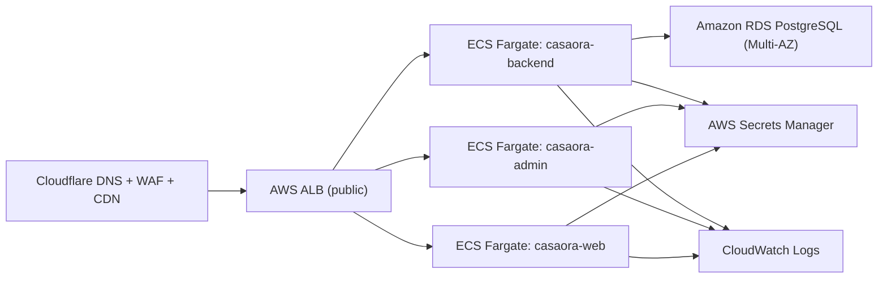

# AWS Infrastructure (Casaora)

This directory contains the AWS infrastructure scaffold for Casaora on:

- Cloudflare (DNS/WAF/CDN)
- AWS ECS Fargate (backend, admin, web)
- Amazon RDS PostgreSQL Multi-AZ (database)
- Clerk (auth)

## What This Foundation Includes

- `apps/backend-rs/Dockerfile` — production container for the Rust/Axum API
- `apps/admin/Dockerfile` — production container for Next.js admin app (ECS-compatible)
- `.github/workflows/aws-ecs-deploy.yml` — manual GitHub Actions workflow to build/push/deploy to ECS
- `infra/aws/ecs/taskdef.backend.json` — ECS task definition template (backend)
- `infra/aws/ecs/taskdef.admin.json` — ECS task definition template (admin)
- `infra/aws/ecs/taskdef.web.json` — ECS task definition template (web)
- `scripts/aws/check-access.sh` — sanity checks for AWS CLI access and required services
- `infra/aws/cloudflare-cutover-checklist.md` — Cloudflare cutover/rollback checklist

## Architecture

Most foundation resources (ECR, VPC, ALB, subnets, security groups, EventBridge schedules) are codified in `infra/terraform/aws/`. ECS task definitions remain as JSON templates in `infra/aws/ecs/`.

## Required GitHub Variables / Secrets (Workflow)

Repository `Secrets`:

- `AWS_GITHUB_OIDC_ROLE_ARN` — IAM role for GitHub OIDC deploys
- `BACKEND_TASK_EXECUTION_ROLE_ARN` (optional if templating in repo is prefilled)
- `ADMIN_TASK_EXECUTION_ROLE_ARN` (optional if templating in repo is prefilled)

Repository `Variables`:

- `AWS_REGION` (e.g. `us-east-1`)
- `ECS_CLUSTER`
- `ECS_SERVICE_BACKEND`
- `ECS_SERVICE_ADMIN`
- `ECS_SERVICE_WEB`
- `ECR_REPOSITORY_BACKEND`
- `ECR_REPOSITORY_ADMIN`
- `ECR_REPOSITORY_WEB`

## Environment / Secret Mapping

Backend (ECS task secrets/env):

- `DATABASE_URL`
- `OPENAI_API_KEY`
- `ENVIRONMENT=production`
- `API_PREFIX=/v1`
- `TRUSTED_HOSTS`
- `CORS_ORIGINS`

Frontend (admin task secrets/env):

- `INTERNAL_API_BASE_URL` (preferred for server-side admin calls, e.g. `http://backend.casaora.internal:8000/v1`)
- `NEXT_PUBLIC_API_BASE_URL`
- `NEXT_PUBLIC_CLERK_PUBLISHABLE_KEY`
- `CLERK_SECRET_KEY`

Cloud Map (optional but recommended):

- Private namespace: `casaora.internal`
- Backend service DNS: `backend.casaora.internal`
- Attach `cloud_map_backend_service_arn` output to ECS backend service via `--service-registries`

## Health Checks

Backend endpoints:

- Liveness: `GET /v1/live`
- Readiness: `GET /v1/ready`

ALB target group health check paths:

- Backend: `/v1/ready`
- Admin: `/`
- Web: `/`
