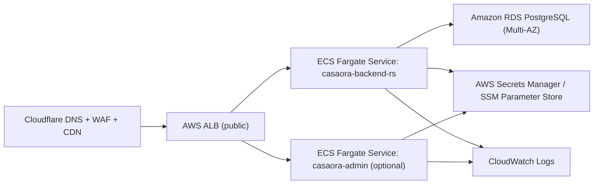

# AWS Migration Foundation (Casaora)

This directory is the first AWS migration scaffold for moving Casaora off Railway/Vercel onto:

- Cloudflare (DNS/WAF/CDN)
- AWS ECS Fargate (backend + optionally admin frontend)
- Amazon RDS PostgreSQL Multi-AZ (database)
- Clerk (auth, later migration phase)

As of February 25, 2026:

- AWS CLI access is verified for account `341112583495`
- Identity Center (SSO) login is working with profile `default`
- Codex MCP bridge still does **not** expose the `aws` MCP server in this session (`unknown MCP server "aws"`), so AWS verification is currently via CLI

## What This Foundation Includes

- `apps/backend-rs/Dockerfile` — production container for the Rust/Axum API
- `apps/admin/Dockerfile` — production container for Next.js admin app (ECS-compatible)
- `.github/workflows/aws-ecs-deploy.yml` — manual GitHub Actions workflow to build/push/deploy to ECS
- `infra/aws/ecs/taskdef.backend.json` — ECS task definition template (backend)
- `infra/aws/ecs/taskdef.admin.json` — ECS task definition template (admin)
- `scripts/aws/check-access.sh` — sanity checks for AWS CLI access and required services
- `infra/aws/cloudflare-cutover-checklist.md` — Cloudflare cutover/rollback checklist

## Target AWS Architecture (Initial)

Recommended next additions (not included yet):

- RDS Proxy for connection pooling/failover
- ECR repository provisioning IaC (Terraform/CDK)
- VPC/subnets/security groups IaC
- ACM certificates + ALB listeners IaC
- ECS service/task definitions in IaC instead of JSON templates

## Migration Phases (Pragmatic Order)

1. Backend hosting cutover (Railway -> ECS Fargate), keep current DB/auth temporarily
2. Frontend hosting cutover (Vercel -> ECS/OpenNext on AWS)
3. Auth migration (Supabase Auth -> Clerk)
4. Database migration (Supabase Postgres -> RDS PostgreSQL Multi-AZ)
5. Storage/realtime cutover (if needed)

## Required GitHub Variables / Secrets (Workflow)

Repository `Secrets`:

- `AWS_GITHUB_OIDC_ROLE_ARN` — IAM role for GitHub OIDC deploys
- `BACKEND_TASK_EXECUTION_ROLE_ARN` (optional if templating in repo is prefilled)
- `ADMIN_TASK_EXECUTION_ROLE_ARN` (optional if templating in repo is prefilled)

Repository `Variables`:

- `AWS_REGION` (e.g. `us-east-1`)
- `ECS_CLUSTER`
- `ECS_SERVICE_BACKEND`
- `ECS_SERVICE_ADMIN`
- `ECR_REPOSITORY_BACKEND`
- `ECR_REPOSITORY_ADMIN`

## Environment / Secret Mapping (Transition-Friendly)

Backend (ECS task secrets/env):

- `DATABASE_URL` (preferred) or `SUPABASE_DB_URL` during transition
- `SUPABASE_URL` (if still using Supabase Auth/Storage)
- `SUPABASE_SERVICE_ROLE_KEY` (temporary until Clerk/RDS cutover)
- `OPENAI_API_KEY`
- `ENVIRONMENT=production`
- `API_PREFIX=/v1`
- `TRUSTED_HOSTS`
- `CORS_ORIGINS`

Frontend (admin task secrets/env):

- `NEXT_PUBLIC_API_BASE_URL`
- `NEXT_PUBLIC_CLERK_PUBLISHABLE_KEY` (future phase)
- `CLERK_SECRET_KEY` (future phase)
- Supabase envs still required until auth migration is implemented in app code

## Backend Health Checks (Already Implemented in API Code)

Use these endpoints in ALB target groups:

- Liveness: `GET /v1/live`
- Readiness: `GET /v1/ready` (recommended ALB/ECS health check path)

## Immediate Next Steps

1. Bootstrap base AWS resources (ECR repos, ECS cluster, log groups):
   - `AWS_PROFILE=default AWS_REGION=us-east-1 ./scripts/aws/bootstrap-ecs-foundation.sh`
2. Bootstrap dedicated network foundation (cost-aware, no NAT gateways by default):
   - `AWS_PROFILE=default AWS_REGION=us-east-1 ./scripts/aws/bootstrap-network-foundation.sh`
3. Create ALB + target groups (bootstrap listener uses `/v1/live` first):
   - `AWS_PROFILE=default AWS_REGION=us-east-1 ./scripts/aws/bootstrap-backend-alb.sh`
4. Request ACM cert for backend hostname:
   - `AWS_PROFILE=default AWS_REGION=us-east-1 DOMAIN_NAME=api.casaora.co ./scripts/aws/request-acm-certificate.sh`
5. Create ECS backend service + bootstrap deploy (public subnets, no NAT required):
   - `AWS_PROFILE=default AWS_REGION=us-east-1 ./scripts/aws/deploy-backend-bootstrap.sh`
6. Create production Secrets Manager entries for backend/frontend envs
7. Switch backend target group/listener health to `/v1/ready` after DB/auth secrets are configured
8. Validate with `/v1/live`, `/v1/ready`, `/v1/public/listings`
9. Cut over Cloudflare DNS using `infra/aws/cloudflare-cutover-checklist.md`

Longer-term productionization after bootstrap:

- Move ECS tasks to private subnets and add either:
  - NAT gateways, or
  - VPC endpoints (ECR API/DKR, CloudWatch Logs, Secrets Manager, SSM, STS as needed)
- Add HTTPS listener using validated ACM cert and forward to backend target group
- Create admin ECS service and separate ALB rule / host-based routing

ALB / target group notes:

- bootstrap target group health check: `/v1/live` (to allow first deploy before DB secrets are in place)
- production target group health check: `/v1/ready`

Historical target group recommendation (final state):

- backend target group health check: `/v1/ready`
- admin target group health check: `/`
